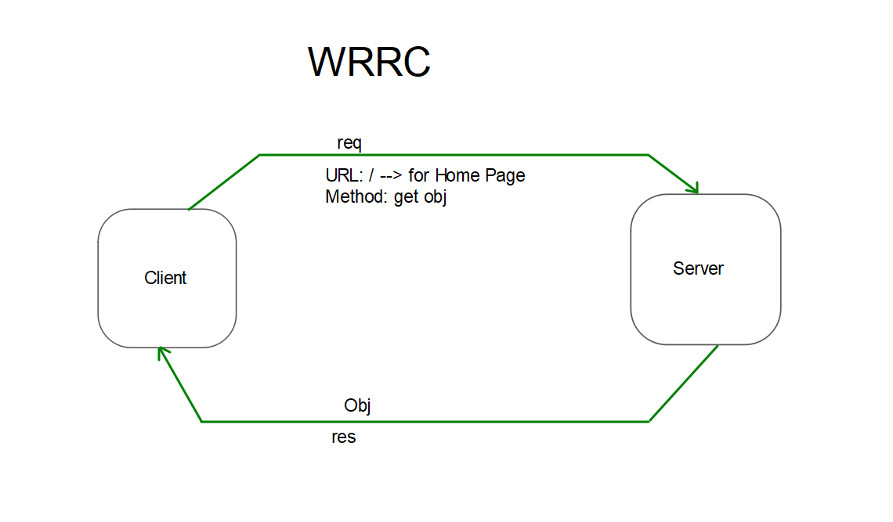

# Movies-Library - Project Version-01

**Author Name**: Mohammad Alfarwan

## WRRC

## Overview

## Getting Started
* `npm init -y`
* `npm install express`
* `node sever.js`

## Project Features

- **Express Framework**: Utilizing Express, a minimalist web framework for Node.js.
  
- **Route Handling**: Defining routes using `server.get()` to handle HTTP GET requests.

- **JSON Data Handling**: Retrieving movie data from a JSON file and sending it as JSON response.

- **Error Handling**: Managing errors for undefined routes and server errors with custom middleware.

- **Custom Data Structure**: Defining a `Movie` constructor function for organizing movie data.

- **Server Configuration**: Configuring the server to listen on port 3000 and logging readiness.
